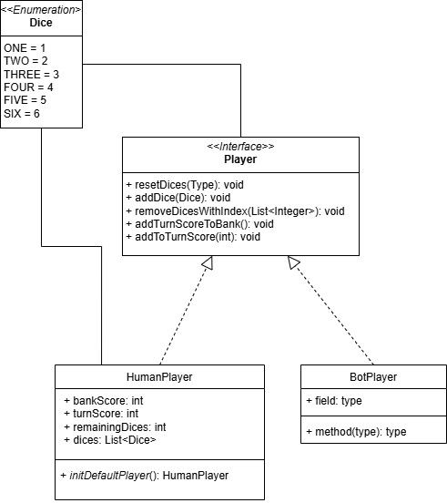

# Farkle
## Description
Implémentation du jeu de dés [Farkle](https://fr.wikipedia.org/wiki/Farkle) 

## Aperçu
TODO

## Installation
TODO

## Utilisation
TODO

## Roadmap
| Version | Date prévue | Description                                                             |
|:--------|:------------|:------------------------------------------------------------------------|
| 1.0     | Nov. 2024   | API Rest et interaction via client shell                                |
| 2.0     | 2025        | Interface graphique                                                     |
| 3.0     | 2025        | Ajout d'un joueur de type robot                                         |
| 3.1     | 2025        | Entrainement de 3 modèles de joueurs robots (facile, normal, difficile) |

## Conception

